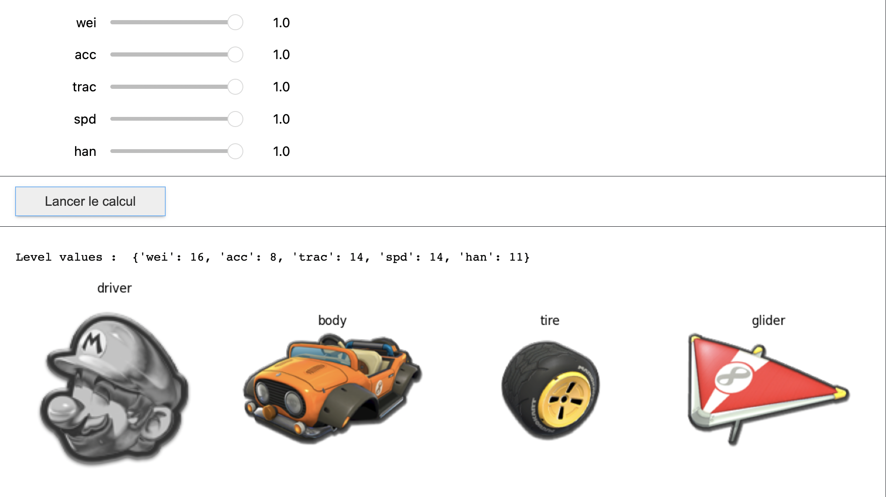

# MarioKart DataDriven (*MKDD*)



## Problem formulation

### Maximization objective 

In MarioKart 8 Deluxe (*MK8D*) game on switch, players compete in car races. To do this, each player chooses a combination of **driver**, **body**, **wheel** and **glider** $(d,b,t,g)$ which produces a final kart. Each component $d$,$b$,$t$,and $g$ has a set of respective integers features that each ranges from 0 to 10 : 
- ***Weight (wei)***
- ***Acceleration (acc)***
- ***Traction (trac)***
- ***Speed (spd)*** 
- ***Handling (han)***

(*NB* : There also is Mini-Turbo and Invincibility features as in game statistics but we omit it for simplicity reasons)

We imagine that each player has his own set of personal preferences for each single category, that represent **preference weights** :

$$w=(w_{wei},w_{acc},w_{trac},w_{spd},w_{han})$$

Ideally, the selected quadruplet $(d,b,t,g)$ maximizes the overall score given the preference parameters :

$$\max_{(d,b,t,g) \in \mathcal{P}}s(d,b,t,g|w)$$

where $\mathcal{P}$ is the set of possible combinations (drivers are grouped in categories that restrict their possible choices of body/tile/glider). 

Here the score function is represented as a simple normalized weighted sum of the features stats for the driver, body, tile, and glider : 

$$ s(d,b,t,g|w) = \sum_{c \in (d,b,t,g)} \sum_{w_s \in w} w_s \times s_c $$ 

where $s_c \in (0,...,10)$ represent the statistic value of component $c$.

### Set of possible combinations
There is actually in the MK8D a panel of choice of **54 drivers**$^*$, **41 bodies**, **22 tires**, **15 gliders**. If we denote by $\mathcal{C}$ the set of all possible combinations, the cardinality of the latter is :

$$ Card(\mathcal{C}) =  54 \times 41 \times 22 \times 15 = 730620$$

$^*$ *Even if there is 48 displayed characters in the selection menu, some drivers propose different variants : Miis have 3 versions (light, medium, large), Link has 2 versions, Villager has 2 versions and Inkling has 2 versions*

Even if this number is extremely high, several combinations produce exactly the same resulting vector of statistics $(wei,acc,trac,spd,han)$. More precisely, there is $6701$ unique possible vectors possibilities ($0.9%$ of $Card(\mathcal{C}$)). 

Moreover, some vectors among these possibilities are **non-Pareto efficient** : it means that for these vectors, there exits at least one other possible vector that provide better statistics at all points. As we aim for optimal combinations, we can omit these latters. We end up with a study set of $4619$ Pareto efficient vectors. 

## Data

Images and In-game statistics comes from [MarioWiki](https://www.mariowiki.com/Mario_Kart_8_Deluxe_in-game_statistics) website.

[Preprocessing](./src/preprocessing/) provide tools for scraping and combinations computations. We end up with an input *[combination.txt](./src/data/combinations.txt)* file text that repertoriates all $4619$ Pareto efficient statistic vectors, with the line format :

$$(wei,acc,trac,spd,han);d_1/b_1/t_1/g_1,...,d_n/b_n/t_n/g_n$$

where $n$ is the number of combinations $(d,b,t,g)$ that lead to vector of statistics $(wei,acc,trac,spd,han)$.

```python
# combinations.txt (example line)
(11, 11, 11, 13, 11);Mario(Mro)/Standard Kart/Standard (tire)/Super Glider,...
```

## API *(TBU)*


